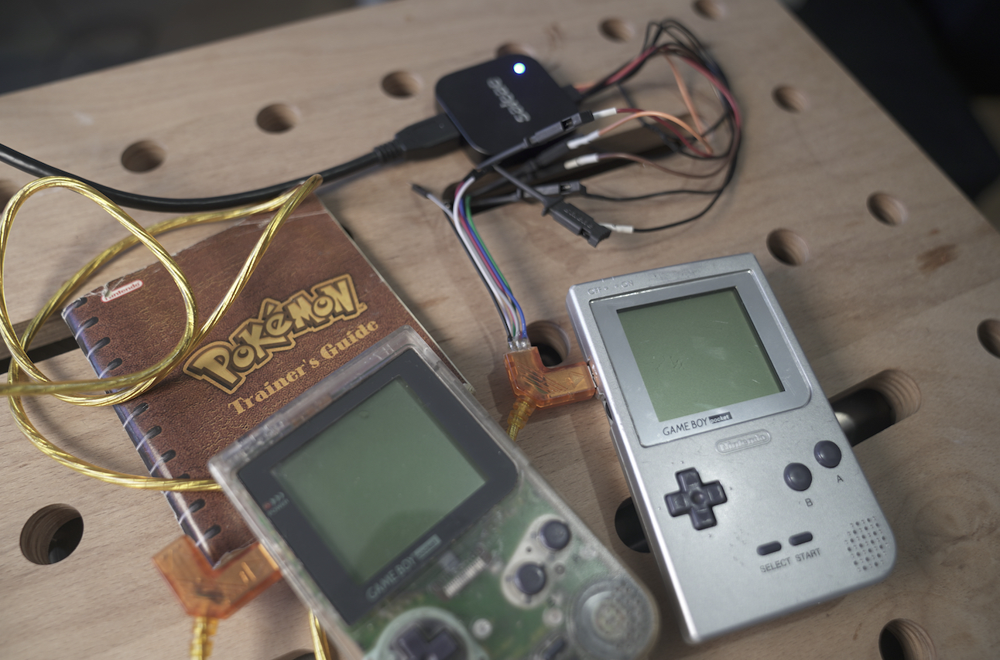
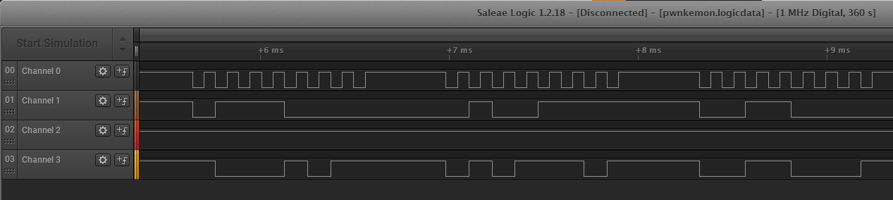
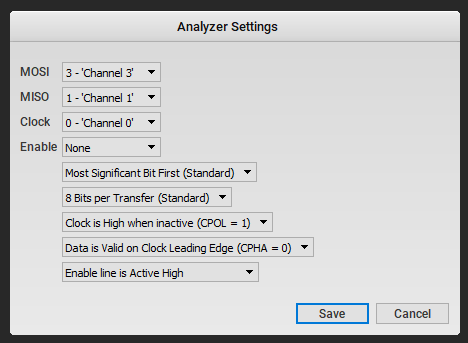
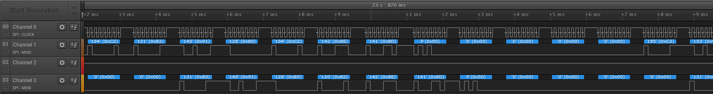

# hardware / PWNkemon

## Question

> The picture should explain everything.
>
> Careful, flag format is in a different format: `CSCG(...)`
>

### Provided Files

Two files provided in `pwnkemon.zip`:

* [`pwnkemon.logicdata`](./pwnkemon.jpg)
* `pwnkemon.jpg` 

## Solution

The image shows two GameBoy Pockets connected with a Link Cable.
There's a device with the logotype "saleae" spliced in.
Searching for "saleae logicdata" brings up Saleae Logic, a program for decoding raw serial data.
Loading up `pwnkemon.logicdata` in Logic shows the intercepted waveforms:



Channel 0 is obviously a clock of some sort.
It looks like channel 2 is always on during transmission, so it can safely be ignored.
Channels 1 and 3 are the data lines, presumably one from each GameBoy.
Looking at Logic's decoder options, it looks like we want a SPI (Serial Peripheral Interface) decoder.
We can now input the channel numbers in the right place in the settings.



After fiddling with the settings a bit (clock edge, MSB/LSB, etc.), we got what looked like text data out.



Displaying hex bytes and ASCII equivalents wasn't very promising, since there weren't any long contiguous strings of printable characters.
We thought something was still wrong, but figured the data was worth playing around with for analysis anyways.

Logic can export this data as a CSV, although it's a really odd format and will need some further parsing.
We opted to export as decimal instead of hex since Logic's hex representation was not consistent.

```csv
Time [s], Analyzer Name, Decoded Protocol Result
2.304880000000000,SPI,MOSI: 1;  MISO: 2
2.321421000000000,SPI,MOSI: 0;  MISO: 0
2.338083000000000,SPI,MOSI: 0;  MISO: 254
11.781027999999999,SPI,MOSI: 0;  MISO: 254
...
```

At this point, we had done some research about the Link Cable protocol, and found a [blog post](http://www.adanscotney.com/2014/01/spoofing-pokemon-trades-with-stellaris.html) by Adan Scotney.
The blog post explained why we had no idea how to decode the bytes:

> I noticed that the first part of the data block was quite short, seemed to have a termination character, and then was padded with 0s.
> I suspected this was text of some sort.
> When the game stores text, it does not do so with standard ASCII mappings.

We found a code page on [Bulbapedia](https://bulbapedia.bulbagarden.net/wiki/Character_encoding_in_Generation_I) for Generation I games.
This allowed us to finally write some Python to decode and search for the flag:

```py
import csv, re
# pokemon code chart 0x60-0xff, spaces are non-printable
# ignore all earlier characters since they are non-printable
code = "ABCDEFGHIVSLM:ぃぅ‘’“”・⋯ぁぇぉ       ABCDEFGHIJKLMNOPQRSTUVWXYZ():;[]abcdefghijklmnopqrstuvwxyzédlstv                                '  -rm?!.ァゥェ▷▶▼♂$×./,♀0123456789"
def poke_chr(x):
  if x < 0x60 or code[x-0x60] == " ":
    return ""
  return code[x-0x60]

with open("mosi-miso.csv", "r") as f:
  r = csv.reader(f)
  data = []
  for row in r:
    # grab serial data only
    data.append(row[2])
  # remove header
  data = data[1:]
# csv format is "MOSI: int; MISO: int"
miso = "".join([poke_chr(int(x.split('; ')[1].split(': ')[1])) for x in data])
mosi = "".join([poke_chr(int(x.split('; ')[0].split(': ')[1])) for x in data])
print("channel 1: " + re.search(r'CSCG\(.+?\)', miso)[0])
print("channel 3: " + re.search(r'CSCG\(.+?\)', mosi)[0])
```

Running this gets us the flag from both channels (although much clearer from channel 3):

```
channel 1: CSCG(GONNAQ777777q998888888888888888888888888888888888888888888888888888888888888888888888888888888888888888888888888888888888888888888888888888888888888888888888888888888888888888888888888888888888888888888888888888888888888888888888888888888888888888888888888888888888888888888888888888888888888888888888888888888888888888888888888888888888888888888888888888888888888888888888888888888888888888888888888888888888888888888888888888888888888888888888888888888888ぅ8ぅぅぅぅぅぅぅぅぅ88ぅ8ぅぅぅぅぅぅぅぅぅぅぅ77777777777yT‘1p7777777REDASHJACD99m?k4ぃA:ゥぉ▶HIHdVI(DBFVゥぉwiGSIぇFVVAg▶ゥぉwiVkLtSWSdVWRs9REDASHJACDRACONDRACONDRACONPIDGEYMAGMARMEWTWOCSCG(GONNAQ777777q99AAAAAAAAAAAAACCCCCCCCCCCCC888888888888888888888888888888888888888C8CCCCCCCCC88C8CCCCCC8CCCC77777777777G.kE[7777777REDASHJACD9:ゥぉ▶HIHdVI(DBFVゥぉwiGSIぇFVVAg▶ゥぉwiVkLtSWSdVWRs99;ZゥぉyHKIsHuHpHD:CYDRACONDRACONDRACONDRACONMAGMARMEWTWOCSCG(GONNA-hack-em-AQ777777E998888888888888888888888888888888888888888888888888888888888888888888888888888888888888888888888888888888A8AAAAAAAAA88CCCCCCCCCCCCC88888888888888888888888888888888888888888C8CCCCCCCCC88C8CCCCCCCCCCC77777777777]mぇ7777777REDASHJACDI9DBFVゥぉwiGSIぇFVVAg▶ゥぉwiVkLtSWSdVWRs99;ZゥぉyHKIsHuHpHD:CYI7Cゥぉ▶EEaEEEぁr7bX.DRACONDRACONDRACONDRACONMEWTWOCSCG(GONNA-hack-em-All-PWNkemoQ777777998888888888888888888888888888888888888888888888888888888888888888888888888888888888888888888888888888888888888888A8AAAAAAAAA88CCCCCCCCCCCCC8888888888888888888888888888888888888888C8CCCCCCCCC88C8CCCCCCCCC8C77777777777'ぃbBs7777777REDASHJACI9ゥぉwiVkLtSWSdVWRs99;ZゥぉyHKIsHuHpHD:CYI7Cゥぉ▶EEaEEEぁr7bX.3K:FゥぉyH”ICIHGs⋯3[U▶DRACONDRACONDRACONDRACONCSCG(GONNA-hack-em-All-PWNkemon!!!)
channel 3: CSCG(GONNA-hack-em-All-PWNkemon!!!)
```

### Flag

`CSCG(GONNA-hack-em-All-PWNkemon!!!)`
