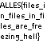

# misc / Archiver

## Question

> Archives exist in many formats.
> I wonder how many exotic ones exist?

### Provided Files

- [`ALLES`](./ALLES)

## Solution

The flag is nested inside archive files, most of which are named `ALLES`.
For convenience, we will refer to each file as `ALLESn` for the `n`th file named `ALLES`.

Generally, we approached this by first running `file` to see if it was easy,
then trying to find a signature in the header of the file.
Archives typically store the filenames in plaintext so if we saw "ALLES" we knew a file signature should be above it.

1.  Running `file` tells us this is `7-zip archive data, version 0.4`.
    We can unzip with `7z`.
2.  Running `file` doesn't get us anything.
    However, opening in a hex editor reveals the magic string `nanozip`.

    ```text
    $ hexdump ALLES2 -C
    00000000  ae 01 4e 61 6e 6f 5a 69  70 20 30 2e 30 39 20 61  |..NanoZip 0.09 a|
    00000010  6c 70 68 61 1f 0f 09 05  3b 05 00 0f 91 00 eb 87  |lpha....;.......|
    00000020  03 41 4c 4c 45 53 00 42  c6 35 49 5f 45 74 5e a1  |.ALLES.B.5I_Et^.|
    ```

    We can find copies of NanoZip, specifically version 0.09 alpha, online.
    It's so old, the [download page](http://nanozip.ijat.my/) links to Internet Archive.
    We found that the Windows binaries worked and we could extract.
    Note that it requires the `.nz` extension.

    ```text
    PS > nanozip.exe x ALLES2.nz
    Intel(R) Core(TM) i5-6600K CPU @ 3.50GHz|12366 MHz|#2+HT|4343/16323 MB
    Archive: ALLES2.nz
    Threads: 2
    Compressor #0: nz_optimum1 [13 MB]
    Decompressed 66 667 bytes in 0.00s, 11 MB/s.
    IO-in: 0.00s, 64 MB/s. IO-out: 0.02s, 2411 KB/s
    ```

3.  Again, running `file` is useless.
    Dumping the header of the file gave no obvious archive type:

    ```text
    00000000  70 51 39 01 37 41 4c 4c  45 53 00 63 00 01 11 d2  |pQ9.7ALLES.c....|
    00000010  00 01 04 57 92 ea 70 bf  11 74 64 6a f5 af 77 69  |...W..p..tdj..wi|
    ```

    Googling variations on "pQ9 comrpession" eventually brings up an experimental
    [PAQ9A](http://mattmahoney.net/dc/#paq9a) version of [PAQ](https://en.wikipedia.org/wiki/PAQ).
    There is only a Windows binary available, and it worked:

    ```text
    PS > .\paq9a\paq9a.exe x ALLES3
    ALLES   405877 KiB
    0.34 sec
    HashTable<16> 4.0649% full, 1.3107% utilized of 262144 KiB
    LZP hash table 0.4167% full of 65536 KiB
    LZP buffer 0.1045% full of 65536 KiB
    LZP 70069 literals, 29 matches (0.0414% matched)
    Used 405877 KiB memory
    ```

4.  `file` actually gives us something: `FreeArc archive <http://freearc.org>`.
    Unfortunately, the downloadable FreeArc binaries did not work and crashed on extract.
    The patched AUR package would not compile.
    We realized we need a later version of FreeArc and found one on the Internet Archive:
    [version 0.67 alpha](https://web.archive.org/web/20120208103920/http://freearc.org/download/testing/FreeArc-portable-0.67-alpha-win32.zip).
    This one worked.
    Like NanoZip, it requires the `.arc` extension.

    ```text
    PS > .\freearc\bin\arc.exe x ALLES4.arc
    FreeArc 0.67 (February 5 2012) extracting archive: ALLES4.arc
    5 recovery sectors (2560 bytes) present
    Scanning archive for damages...
    Archive integrity OK
    Extracted 1 file, 66,555 => 66,523 bytes. Ratio 100.0%
    Extraction time: real 0.03 secs. Speed 1,957 kB/s
    All OK
    ```

5.  No more luck with `file`.
    The hex dump gives us signature `MPQ`.

    ```text
    $ hexdump ALLES5 -C
    00000000  4d 50 51 1a 20 00 00 00  db 03 01 00 00 00 03 00  |MPQ. ...........|
    00000010  3b 03 00 00 3b 03 01 00  00 10 00 00 0a 00 00 00  |;...;...........|
    00000020  08 00 00 00 7b 00 00 00  08 00 04 92 98 01 91 e7  |....{...........|
    ```

    Google finds [MPQExtractor](https://github.com/Kanma/MPQExtractor),
    a program for extracting `.mpq` files from the video game Diablo II.
    It has to be built from source and has a weird CLI.
    We had to read the file list to a text file, then select files to individually extract.

    ```text
    $ ./mpqextractor/build/bin/MPQExtractor -l ALLES5.txt ALLES5
    Opening 'ALLES5'...
    $ cat ALLES5.txt
    data\global\excel\UniqueArchivers
    data\global\items\flag.dc6
    data\global\tiles\ACT1\CAVES\placeholder
    data\global\tiles\ACT1\COURT\placeholder
    data\global\tiles\ACT1\crypt\placeholder
    data\global\tiles\ACT1\Monastry\placeholder
    data\global\tiles\ACT1\Outdoors\placeholder
    data\global\tiles\ACT1\Town\placeholder
    data\global\tiles\ACT1\tristram\placeholder
    $ ./mpqextractor/build/bin/MPQExtractor -e "data\\global\\items\\flag.dc6" -o . ALLES5
    Opening 'ALLES5'...
    Extracting files...
    ```

6.  Coincidentally, the 6th layer was a `.dc6` file.
    This is an image file from Diablo II.
    A few forum posts made reference to a program called "DC6Creator", and we found
    [a version](http://phrozenkeep.blob.core.windows.net/public/files/tools/image/DC6_Creator_1.02.rar).
    It required installing .NET 2002 libraries, which is a nice blast from the past.
    DC6Creator allows a `.bmp` export, which reveals our flag:

    

### Flag

`ALLES{files_in_files_in_files_are_freezing_hell}`
