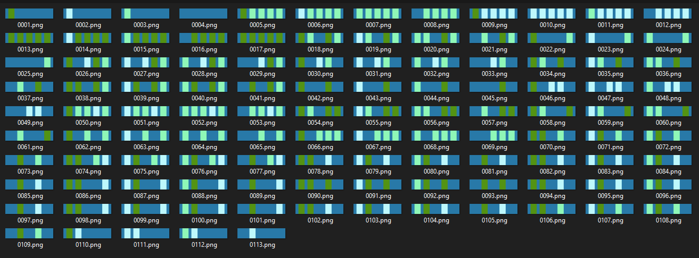
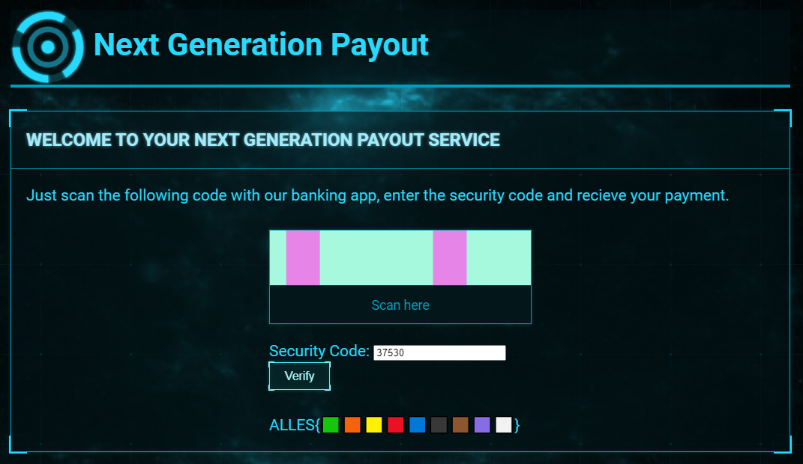

# misc / Next Generation Payout

## Question

> The future is here!
> Thanks to our new payment method, you can just scan our fancy image, enter the secret code and instantly receive your payment!!1!1
>
> Friendly Haxxor: Boys i don't like this new NGP Banking sh\*t, I intercepted network traffic from their old NGP version.
> Hopefully you could use this to steal all their money REEEEE

### Provided Files

- [`NGPv1_sniff.pcapng`](./NGPv1_sniff.pcapng)

## Solution

The `.pcapng` file is a Wireshark packet capture.
We can extract two important files from here, a `flicker.gif` and a JSON representation of the data:


```json
{ "iban": "DE1922832821", "security_code": "11337", "account_number": "82561" }
```

The code has five coloured blocks and four possible colours (including the "background" null colour).
Navigating to the provided webpage shows a similar flickering code with different colours.
We will have to decode the `security_code` to find the flag.
Begin by analyzing the frames of `flicker.gif`:



Scanning frame-by-frame, the first block simply repeats the four colours.
The data blocks only change every fourth frame/one clock cycle.
There are four colours × four blocks = 1 byte of information per cycle.

The first four clock cycles also have all four of the other blocks as one colour, as if to introduce the colour scheme.

Knowing that the IBAN must appear somewhere, we decoded the block order as 2, 1, 4, 3.

Even with the IBAN appearing in this decoding, the security code and account number were not there.
Eventually, we noticed that the remaining bytes can be interpreted as
[binary-coded decimal](https://en.wikipedia.org/wiki/Binary-coded_decimal)
after seeing them appear in the hex representation
(hex and 8421 BCD are the same, hex just allows values above 9).

The security code appears from the second half of byte 4 to the end of byte 7.

With this knowledge, we wrote a script to
(1) figure out the colour scheme,
(2) interpret the bits in the right order, and
(3) extract the security code:

```py
from PIL import Image
clock = None
colors = {}
im = Image.open("web.gif")

def get_frame(im):
    positions = [(20, 0), (70, 0), (110, 0), (150, 0), (200, 0)]
    px = im.convert('RGB')
    return [px.getpixel(xy) for xy in positions]
def next_frame(im):
    im.seek(im.tell() + 1)
    while get_frame(im)[0] != clock:
        im.seek(im.tell() + 1)
    return get_frame(im)

im.seek(1)
clock = get_frame(im)[0]
im.seek(0)
msg = b''
try:
    for i in range(4):
        frame = next_frame(im)
        colors[frame[1]] = ["00", "01", "10", "11"][i]
    while 1:
        frame = next_frame(im)
        decode = [colors[col] for col in frame]
        byte = decode[2] + decode[1] + decode[4] + decode[3]
        msg += bytes([int(byte, base=2)])
except EOFError:
    pass

# code is at bytes 4.5-7 in binary coded decimal (i.e. hex string)
print('code: ' + msg[3:6].hex()[1:])
```

Running this on the generated GIF from the site gives us the security code:

```text
$ python decode.py
code: 37590
```

Entering the code displays the flag:



### Flag

`ALLES{🟩🟧🟨🟥🟦⬛🟫🟪⬜}`
