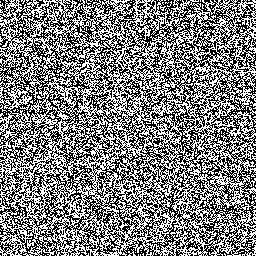

# crypto / Perfect Secrecy

## Question

> Alice sent over a couple of images with sensitive information to Bob, encrypted with a pre-shared key.
> It is the most secure encryption scheme, theoretically...

### Provided Files

- `image1.png`
- `image2.png`

## Solution

"The most secure encryption scheme", in theory, is a one time pad.
The two images are just black and white pixels, so simple operations can be done on them in an image editor:

&nbsp;

After experimenting with a few options, taking the difference between `image2` and `image1` reveals some dopey handwritten text:

This base 64 string `ZmxhZ3swbjNfdDFtM19QQGQhfQ==` translates to `flag{0n3_t1m3_P@d!}`.

### Flag

`flag{0n3_t1m3_P@d!}`
