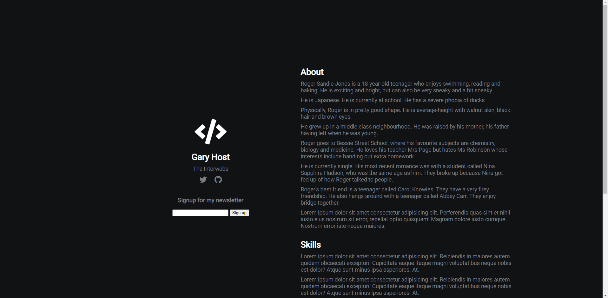
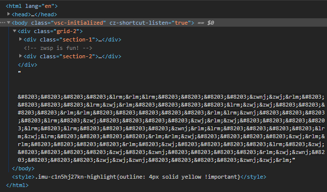

# web / widthless

## Question

> Welcome to web! Let's start off with something kinda funky :)
>
> http://web.chal.csaw.io:5018

## Solution

The webpage has a text input box and nothing particularly special.



However, upon inspection of the HTML, there are a bunch of zero-width characters at the bottom of the page.



We find that there are five different characters, ranging in the Unicode block U+200B to U+200E.
Specifically, these are the zero width space, zero width non-joiner, zero width joiner, left to right marker, and right to left marker.

Replacing each of these with their last hex char for ease of representation, we get `BBBBEFEBBBBCDFBBBBEDFBBBBEDDBBBBFFBBBBBFECBBBBEBDBBBBDFDBBBBEBEBBBBCFEBBBBEDEBBBBFFDBBBBDFFBBBBFBDBBBBEBDBBBBDBCBBBBFDCBBBBDDCBBBBCDF`.

The long strings of `B`s are obvious now, and this splits nicely into groups of seven:

```py
data = ['BBBBEFE', 'BBBBCDF', 'BBBBEDF', 'BBBBEDD', 'BBBBFFB',
        'BBBBFEC', 'BBBBEBD', 'BBBBDFD', 'BBBBEBE', 'BBBBCFE',
        'BBBBEDE', 'BBBBFFD', 'BBBBDFF', 'BBBBFBD', 'BBBBEBD',
        'BBBBDBC', 'BBBBFDC', 'BBBBDDC', 'BBBBCDF']
```

This is probably some sort of encoded text.
Since we have five characters, we can bruteforce different base-5 representations:

```py
for p in itertools.permutations('BCDEF'):
    result = []
    for item in data:
        result.append(item)
        for i, c in enumerate(p):
            result[-1] = result[-1].replace(c, str(i))
        result[-1] = int(result[-1], 5)
    try:
        result = bytes(result).decode()
        print(result)
    except:
        pass
```

This will print out a bunch of gibberish but also `YWxtMHN0XzJfM3o=`, which is clearly base 64.
Decoding that gives `alm0st_2_3z`.
This is not the flag.
However, we can place this in the text box on the website to get the text `ahsdiufghawuflkaekdhjfaldshjfvbalerhjwfvblasdnjfbldf/<pwd>` to show up.
Assuming `<pwd>` is our password we discovered, navigating to
http://web.chal.csaw.io:5018/ahsdiufghawuflkaekdhjfaldshjfvbalerhjwfvblasdnjfbldf/alm0st_2_3z
gets us a slightly different page with another set of zero-width characters.
This page's widthless chars are spread out, so we must collect them all before running our script again:

```py
with open('alm0st_2_3z.html', 'rb') as f:
    html = b''.join(f.readlines())
zw_chars = re.findall(b'\xe2\x80.', html) # find U+200x chars
last_nibbles = [hex(s[-1]).upper()[-1] for s in zw_chars] # get hex representation
data = [''.join(last_nibbles[i:i+7]) for i in range(0, len(last_nibbles), 7)] # group into sevens
```

The least-gibberish output is this time `755f756e6831645f6d33`, ASCII hex for `u_unh1d_m3`.
Entering this password reveals the text `/19s2uirdjsxbh1iwudgxnjxcbwaiquew3gdi/<pwd1>/<pwd2>`, and navigating to
http://web.chal.csaw.io:5018/19s2uirdjsxbh1iwudgxnjxcbwaiquew3gdi/alm0st_2_3z/u_unh1d_m3
reveals the flag.

### Flag

`flag{gu3ss_u_f0und_m3}`
