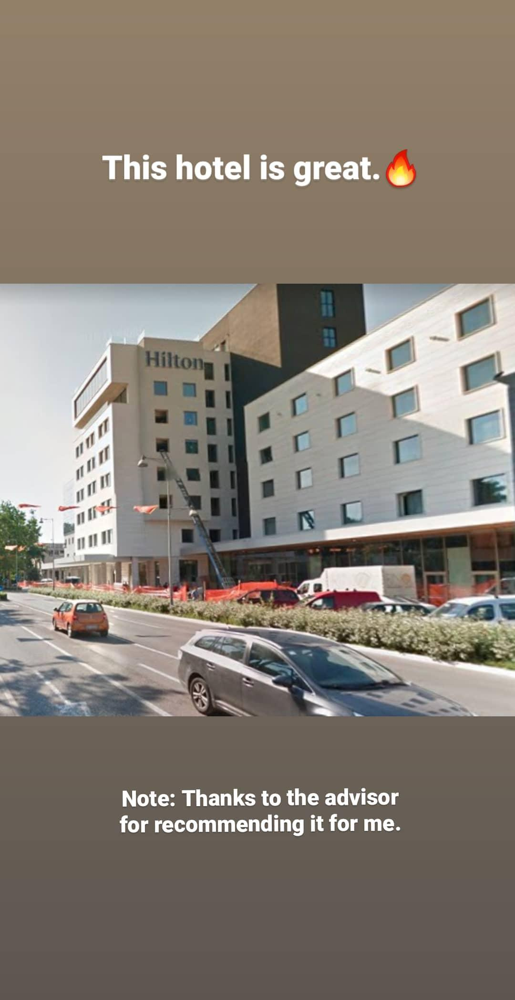

# osint / Identity Fraud

> Points: 419

## Question

> Someone stole our logo and created a team named "Eword".
>
> In order to find him, I created a fake twitter account (@1337bloggs) to join
> Eword team.
>
> Fortunately, they replied to the fake account and gave me a task to solve.
> So, if I solve it, they will accept me as a team member.
>
> ... Can you help me in solving the task?

## Solution

From the provided [Twitter account's replies](https://twitter.com/1337bloggs/with_replies),
we are [instructed](https://twitter.com/EwordTeam/status/1298723524194910208) to check the
[EWord CTFTime page](https://ctftime.org/team/131587).

> Please check our team page in CTFtime, there is something for you.\
> ...\
> Important note:\
> Take a screenshot of the page, then tell us when you do that,
> because we will delete it before anyone see it.

Nothing is there since they said they would delete it, but checking the Internet Archive
[for CTFtime](http://web.archive.org/web/20200826195056/https://ctftime.org/team/131587)
reveals a [Pastebin](https://pastebin.com/8bk9qLX1) instructing us to find the leader
of EWord. It also has a link to a [second Pastebin](https://pastebin.com/PZvaSjA0).

The second Pastebin contains a Base64 image.

This is an Instagram story. Cropping the hotel building and running it through Yandex
reverse image search reveals that this is the Hilton in Podgorica, Montenegro.

Google searching `"Hilton Podgorica" EWord` reveals a review on
[TripAdvisor](https://www.tripadvisor.ca/Hotel_Review-g304088-d600703-Reviews-Hilton_Podgorica_Crna_Gora-Podgorica_Podgorica_Municipality.html)
by one Wokaihwokomas Kustermann, with the username `check_my_instagram`.

Searching Instagram for Wokaihwokomas Kustermann reveals
[an account](https://www.instagram.com/wokaihwokomaskustermann).
The profile picture on the account has the flag hidden along the edge.

### Flag

`EWord{c0ngraAatulationZzZz_aNd_w3lCom3_to_Eword_Team_!}`
