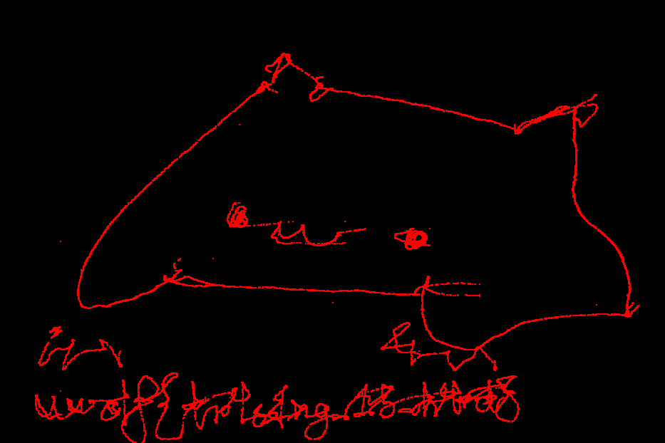

# rev / paper

> Points: 500

## Question

> my friend sent me something they drew on some weird paper...

### Provided Files

- [`paper`](./paper)

## Solution

The file format is not immediately recognizable.
Opening in a hex editor, there is a clear pattern of bytes:
```text
$ hexdump paper | head
0000000 bd5f 5fbc b936 000d 0001 0140 0001 0000
0000010 bd5f 5fbc b936 000d 0003 0000 132f 0000
0000020 bd5f 5fbc b936 000d 0003 0001 07a5 0000
0000030 bd5f 5fbc b936 000d 0000 0000 0000 0000
0000040 bd5f 5fbc c062 000d 0000 0000 0000 0000
0000050 bd5f 5fbc c79c 000d 0003 0000 132e 0000
0000060 bd5f 5fbc c79c 000d 0000 0000 0000 0000
0000070 bd5f 5fbc cee3 000d 0003 0000 132d 0000
0000080 bd5f 5fbc cee3 000d 0000 0000 0000 0000
0000090 bd5f 5fbc d60f 000d 0003 0000 132b 0000
```
Since the challenge description talks about "drawing",
we figured this was probably a dump from a drawing tablet or similar.
After searching common formats, we didn't find anything.
At this point, we decided it would be easier to just reverse engineer.

We analyze each row of 16 bytes as a packet.
It looks like data is sent on bytes `0xC` and `0xD`
whenever byte `0x8` is set to `0x03`.
Also, in about half of these packets, byte `0x09` is set to `0x01`.

A drawing tablet would have to convey an `x` and `y` coordinate.
After some trial and error, we found that the data bytes `0xC`-`0xD`
were coordinates depending on byte `0x09` for the axis.
Since the packets were all (presumably) in order,
we can draw points keeping previous coordinates until updated.

We applied this algorithm with (messy) Python code:
```py
from tkinter import *

master = Tk()
w = Canvas(master, width=1280, height=720)
w.pack()
scale = 10
s = 0.1

x = 0
y = 0

w.create_rectangle(0, 0, 1280, 720, fill="#000000")

data = open("paper", "rb").read()
for i in range(0, len(data), 16):
    p = data[i:i+16]
    if p[8] == 3:
        if p[10] == 0:
            x = p[12] + p[13] * 256
        if p[10] == 1:
            y = p[12] + p[13] * 256

        oy = y / scale
        ox = x / scale

        w.create_oval(ox - s, oy - s, ox + s, oy + s, fill=f"ff0000", outline=f"ff0000")

mainloop()
```

This produces some scribbles:



from which we can read off the flag by guessing until we get it right,
knowing how much challenge authors have a penchant for 1337code.

### Flag

`uwctf{tr4c1ng_15_h4rd}`
