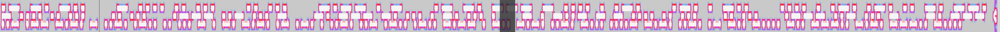

# rev / strange

> Points: 400

## Question

> Since you guys gobble up challs so fast here's one that you've probably never done before...
>
> Note: this chall is so Strange that I'm not 100% sure it's solvable, and it hasn't been tested, so if you think it's broken or unsolvable let me know.

### Provided Files

- [`Strange.mp4`](./Strange.mp4)

## Solution

Putting the audio through a spectrograph revealed what couldn't not be
some sort of encoded data.

After trying a whole bunch of possible encodings,
we realized if you adjust the knobs on your spectrograph settings a bit,
it becomes very, very clearly Morse code.



The three lines read:
```text
AND THIS IS YET ANOTHER RED HERRING
THIS IS JUST NONSENSE TE=TTHIS IS JUST NO
UWCTFLISTENCAREFULLYEDCFB4CFAD6D8C86
```

### Flag

`uwctf{listencarefully_edcfb4cfad6d8c86}`
